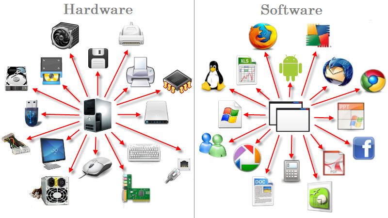
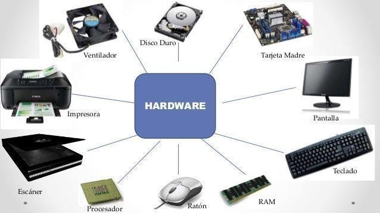

# Hardware, Software sus diferencias y complementos.

## Hardware
El Hardware se trata de todos los componentes electronicos que facilitan el uso de la computadora, como lo es la pantalla, el teclado, el ratón y componentes internos como el disco duro o la placa madre. Se distinguen como Hardware interno y Hardware periférico, el interno se compone de cables CPU, Memoria RAM, Tarjeta grafica y disco duro, mientras que el Hardware periferico se compone de objetos externos pero que de igual manera están enlazados con funciones internas del computador como lo es el teclado, el ratón, el monitor, impresora o una memoria USB.

### Partes del Hardware y especificaciones  

- **CPU**: La funcion del CPU (central processing unit) es interpretar las instrucciones de un programa informático mediante operaciones básicas aritméticas lógicas y externas. Su diseño y eficiencia ha mejorado notablemente a traves de los años gracias a su cambio de costo energia y mayor capacidad y velocidad para procesar la información.

- **RAM**: es una herramienta de memoria a corto plazo la cual lleva a cabo las acciones que solicita el procesador y otras acciones que realizan unidades secundarias del computador, esta guarda de forma temporal los programas y sus procesos de ejecución.