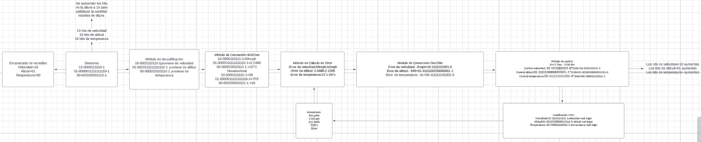
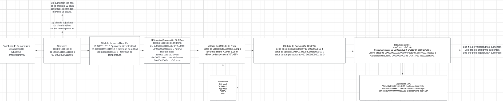
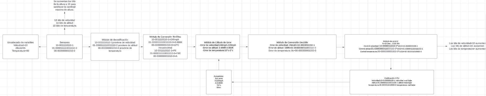

# Conclusiones

-La importancia de separar y señalizar de manera propia cada módulo, su función y su manera de interpetrar los codigos que se le muestran a cada uno, es vital para el entendimiento y la seguridad de todos los procesos que se llevan a cabo diariamente. 

-El codigo binario a pesar de ser una herramienta que parece muy básica, es fundamental para el entendimiento de los comandos que la máquina procesa y realiza diariamente.

-Es importante el uso de bits al inicio y final de cada numero para identificar su paridad sañalar su dirección y su signo.

